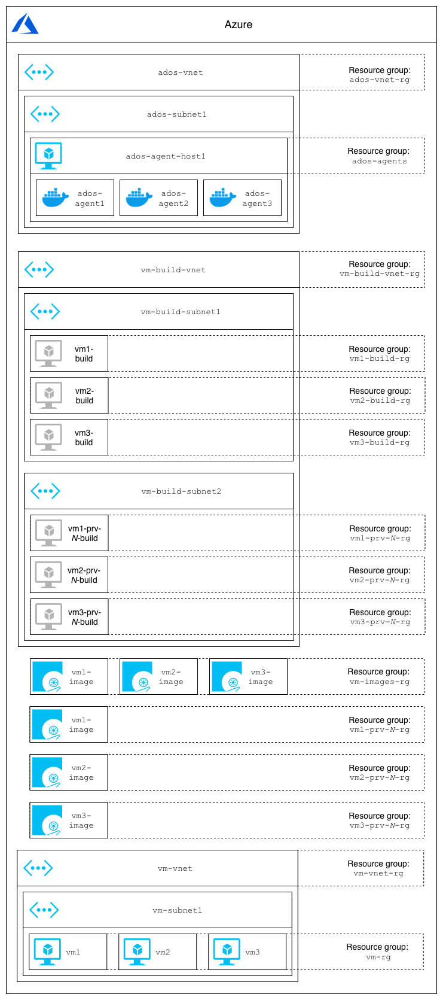
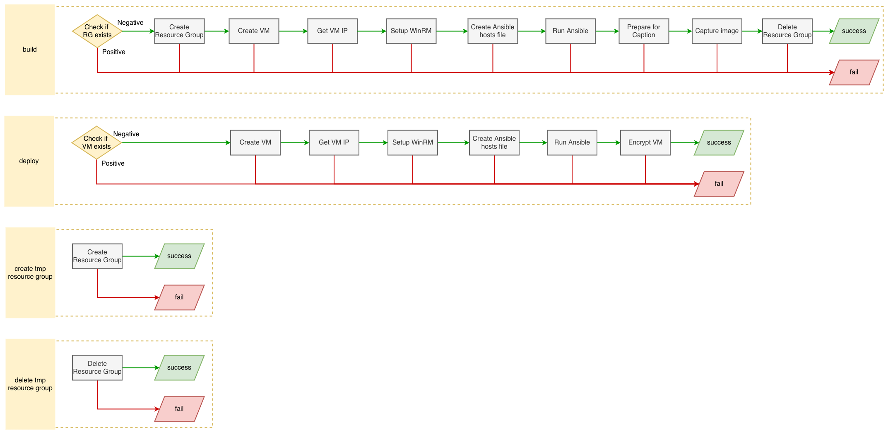
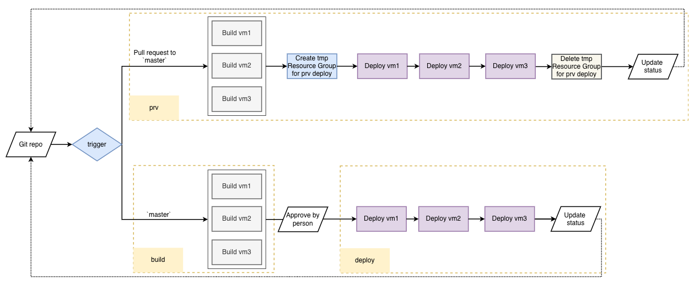

| Build status  | License |
| ------------- | ------------- |
| [](https://dev.azure.com/kagarlickij/azure-packer-alternative/_build/latest?definitionId=34&branchName=master) | [](LICENSE.md)  |

# Task
Task is to create 3 Azure VM images for legacy application installed and configured by Ansible  

## Temporary virtual machine (used to capture image from):
1. Must be placed in pre-defined Azure VNet's Subnet (instead of temporary VNet and Subnet created by Packer by default)
2. Must have Private IP only (by default Packer creates Public IPs)
3. Must be set by Ansible (for demo purposes Ansible creates `C:\build_config.txt`) using variables from:
  * `var1` from Azure DevOps Variable group `ansible-build-common` as regular variable
  * `var2` from Azure DevOps Variable group `ansible-build-common` as secret variable
  * `var3` from Azure DevOps Variable group `ansible-build-vm*` as regular variable
  * `var4` from Azure DevOps Variable group `ansible-build-vm*` as secret variable

## Production (resulting) virtual machine:
1. Must be placed in pre-defined Azure VNet's Subnet
2. Must have Private IP only
3. Must be set by Ansible (for demo purposes Ansible creates `C:\deploy_config.txt`) using variables from:
  * `var1` from Azure DevOps Variable group `ansible-deploy-common` as regular variable
  * `var2` from Azure DevOps Variable group `ansible-deploy-common` as secret variable
  * `var3` from Azure DevOps Variable group `ansible-deploy-vm*` as regular variable
  * `var4` from Azure DevOps Variable group `ansible-deploy-vm*` as secret variable
  * `var5` **for VM2 and VM3 only:** IP address of VM1 from Azure DevOps pipeline
  * `var6` **for VM3 only:** IP address of VM2 from Azure DevOps pipeline

## Azure Resources


# Challenges
## Ansible variables
As you might noticed above `ansible-build-common` and `ansible-deploy-common` have the same variable names as required by legacy app  
..and all VMs have the same variable names in `ansible-deploy-vm1`, `ansible-deploy-vm2` and `ansible-deploy-vm3`  
This issue is solved by linking Azure DevOps Variable groups to specific stages and jobs in pipeline instead of the whole pipeline's level  

## Issues with Packer
## 1. Azure DevOps Service Connection for Azure doesn't work with Packer
Solution is to use "Azure Active Directory Service Principal" which is less safe and convenient than Azure DevOps Service connection  
## 2. Packer's Ansible connection plugin fails for Windows
https://stackoverflow.com/questions/59599834/packers-ansible-connection-plugin-fails-for-windows  
## 3. Packer's {{ .WinRMPassword }} var is empty for azure-arm builder
https://stackoverflow.com/questions/59624603/packers-winrmpassword-var-is-empty-for-azure-arm-builder  
## 4. Multiple builders in Packer template don't work
https://stackoverflow.com/questions/59864732/packer-dedicated-provisioners-for-builders  
## 5. Build the same template on multiple agents (VMs or Docker containers) in parallel always fails
https://stackoverflow.com/questions/59864317/packer-azure-arm-fails-when-running-in-parallel  
## 6. My favorite one: Packer is too Flaky
https://stackoverflow.com/questions/59990155/packer-vs-vm-on-azure-timeout-waiting-for-winrm  

# Packer replacement
Solution is to use Azure CLI to replace what Packer does, e.g. CReate VM, Setup WinRM, Run Ansible, Capture image, Terminate tmp resources  
  

# Azure DevOps pipeline
  
## Production vs Pull request verification
Pipeline supports Pull requests verification (on Pull request to `master` branch) and VM image build and deploy (on commit to `master` branch)  
Pull request verification (PRV) builds and deploys image to temporary environment:  
If PRV verification is successful, code snapshot is marked as valid for merging and tmp environment is deleted  
If PRV verification failed code snapshot is marked as invalid and tmp environment is not deleted for manual investigation  
## Agent and network
Azure DevOps agent must have access to the virtual network that is used for VM image build  
Azure DevOps agents are executed in Docker [kagarlickij/packer-ansible-azure-docker-runtime:3.1.0](https://hub.docker.com/repository/registry-1.docker.io/kagarlickij/packer-ansible-azure-docker-runtime/builds/31d492d9-4d3b-4366-9add-d837c1d757d6) runtime with preinstalled Packer, Ansible, Azure CLI and necessary Python packages  
Azure DevOps agents can be started on VM on system startup: `@reboot /root/ados-agents-start.sh` in `crontab -e`  
`ados-agents-start.sh` script:
```
#!/bin/bash

for run in {1..5}
do
  docker run -d -e VSTS_ACCOUNT='kagarlickij' -e VSTS_POOL='Self-Hosted-Containers' -e VSTS_TOKEN='a***q' kagarlickij/packer-ansible-azure-docker-runtime:3.1.0 > /dev/null 2>&1
done
```

## Templates
Pipeline has some repeating steps which are moved to `./templates` to avoid code duplication  
Templates are not plugins so some pieces (e.g network settings) are "hardcoded"  
Template types are Job (for deploy) and Step (for all other) not because of the most suitable kind but because [templates can not be used as dependency for other jobs/stages/etc](https://stackoverflow.com/questions/59937679/azure-devops-template-as-a-dependency-for-a-job?noredirect=1#comment105997940_59937679)  

## Deploy approval
Environment in ADOS Pipelines will be created automatically by Pipeline  
[To Set Deploy approval open `Approvals and checks` params of Environment and add Approval](https://docs.microsoft.com/en-us/azure/devops/pipelines/process/approvals?view=azure-devops&tabs=check-pass)  
[Deploy notifications don't work in ADOS yet](https://stackoverflow.com/questions/59702813/azure-devops-doesnt-send-deployment-approval/)  

# Required input (Azure DevOps variable groups)
## azure-connection
| Name | Value | Type | Comment |
|--|--|--|--|
| azureSubscription | `Pay-As-You-Go (b31bc8ae-8938-41f1-b0b2-f707d811d596)` | Regular | Subscription Name under which the build will be performed |
| azureSubscriptionId | `b31bc8ae-8938-41f1-b0b2-f707d811d596` | Regular | [azure_subscription_id](https://www.packer.io/docs/builders/azure-arm.html#azure_subscription_id) Subscription Id under which the build will be performed |

## azure-tags
| Name | Value | Type | Comment |
|--|--|--|--|
| environment | `sbx` | Regular | [Tags](https://www.packer.io/docs/builders/azure-arm.html#azure_tags) are applied to every resource deployed, i.e. Resource Group, VM, NIC, etc. |
| project | `ere` | Regular | [Tags](https://www.packer.io/docs/builders/azure-arm.html#azure_tags) are applied to every resource deployed, i.e. Resource Group, VM, NIC, etc. |

## azure-resources
| Name | Value | Type | Comment |
|--|--|--|--|
| vmRegion | `East US` | Regular | Azure Region used for build, deploy and prv; However different regions can be used for different activities |
| vmSourceImage | `Win2016Datacenter` | Regular | Azure Image to be used a source; Solution is tested with both Windows 2016 and Windows 2019 |
| vmBuildVnetName | `vm-build-vnet` | Regular | Name of Azure Virtual Network used by build activities; However all activities can happen in the same VNet |
| vmBuildVnetResourceGroupName | `vm-build-vnet-rg` | Regular | Name of the Azure Resource Group that hosts Azure Virtual Network used by build activities |
| vmBuildVnetSubnetName | `vm-build-subnet1` | Regular | Name of the Subnet used by build activities; Obviously must belong to `vmBuildVnetName` |
| vmBuildPrvVnetSubnetName | `vm-build-subnet2` | Regular | Name of the Subnet used by prv activities; Obviously must belong to `vmBuildVnetName` |
| vmImagesResourceGroupName | `vm-images-rg` | Regular | Name of the Azure Resource Group that hosts created VM images |
| vmVnetName | `vm-vnet` | Regular | Name of Azure Virtual Network used to host deployed VMs |
| vmVnetResourceGroupName | `vm-vnet-rg` | Regular | Name of the Azure Resource Group that hosts Azure Virtual Network used to host deployed VMs |
| vmVnetSubnetName | `vm-subnet1` | Regular | Name of the Subnet used to host deployed VMs; Obviously must belong to `vmVnetName` |
| vmResourceGroupName | `vm-rg` | Regular | Name of the Azure Resource Group that hosts deployed VMs |
| vm1BuildResourceGroupName | `vm1-build-rg` | Regular | Name of the Azure Resource Group that hosts temporary VM used for Image creation; This one is automatically created/deleted by pipeline |
| vm1ImageName | `vm1-image` | Regular | Name of the Azure Image for VM1 |
| vm1KeyVaultName | `vm1-kv` | Regular | Name of the Azure KeyVault used to encrypt VM1 |
| vm1Name | `vm1` | Regular | Name of the VM1 |
| vm1Size | `Standard_DS2_v2` | Regular | Size of the VM1 |
| vm2BuildResourceGroupName | `vm2-build-rg` | Regular | Name of the Azure Resource Group that hosts temporary VM used for Image creation; This one is automatically created/deleted by pipeline |
| vm2ImageName | `vm2-image` | Regular | Name of the Azure Image for VM2 |
| vm2KeyVaultName | `vm2-kv` | Regular | Name of the Azure KeyVault used to encrypt VM2 |
| vm2Name | `vm2` | Regular | Name of the VM2 |
| vm2Size | `Standard_DS2_v2` | Regular | Size of the VM2 |
| vm3BuildResourceGroupName | `vm3-build-rg` | Regular | Name of the Azure Resource Group that hosts temporary VM used for Image creation; This one is automatically created/deleted by pipeline |
| vm3ImageName | `vm3-image` | Regular | Name of the Azure Image for VM3 |
| vm3KeyVaultName | `vm3-kv` | Regular | Name of the Azure KeyVault used to encrypt VM3 |
| vm3Name | `vm3` | Regular | Name of the VM3 |
| vm3Size | `Standard_DS2_v2` | Regular | Size of the VM3 |

## ansible-build-common
| Name | Value | Type | Comment |
|--|--|--|--|
| var1 | `sample-value-of-ansible-build-common-var1` | Regular | Just a sandbox example |
| var2 | `********` | Secret | Just a sandbox example |

## ansible-build-vm1
| Name | Value | Type | Comment |
|--|--|--|--|
| var3 | `sample-value-of-ansible-build-vm1-var3` | Regular | Just a sandbox example |
| var4 | `********` | Secret | Just a sandbox example |

## ansible-build-vm2
| Name | Value | Type | Comment |
|--|--|--|--|
| var3 | `sample-value-of-ansible-build-vm2-var3` | Regular | Just a sandbox example |
| var4 | `********` | Secret | Just a sandbox example |

## ansible-build-vm3
| Name | Value | Type | Comment |
|--|--|--|--|
| var3 | `sample-value-of-ansible-build-vm3-var3` | Regular | Just a sandbox example |
| var4 | `********` | Secret | Just a sandbox example |

## ansible-deploy-common
| Name | Value | Type | Comment |
|--|--|--|--|
| var1 | `sample-value-of-ansible-deploy-common-var1` | Regular | Just a sandbox example |
| var2 | `********` | Secret | Just a sandbox example |

## ansible-deploy-vm1
| Name | Value | Type | Comment |
|--|--|--|--|
| var3 | `sample-value-of-ansible-deploy-vm1-var3` | Regular | Just a sandbox example |
| var4 | `********` | Secret | Just a sandbox example |

## ansible-deploy-vm2
| Name | Value | Type | Comment |
|--|--|--|--|
| var3 | `sample-value-of-ansible-deploy-vm2-var3` | Regular | Just a sandbox example |
| var4 | `********` | Secret | Just a sandbox example |

## ansible-deploy-vm3
| Name | Value | Type | Comment |
|--|--|--|--|
| var3 | `sample-value-of-ansible-deploy-vm3-var3` | Regular | Just a sandbox example |
| var4 | `********` | Secret | Just a sandbox example |

## ansible-windows-creds
| Name | Value | Type | Comment |
|--|--|--|--|
| ansibleUser | `ansible` | Regular | Windows user created for Ansible |
| ansibleUserPass | `********` | Secret | Windows user password created for Ansible |
