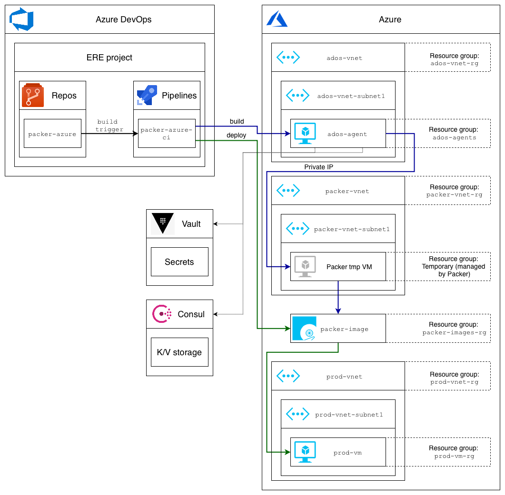

| Build status  | License |
| ------------- | ------------- |
|   |   |

# Task
## Packer (temporary) virtual machine:
1. Must be placed in pre-defined Azure VNet's Subnet (instead of default temporary VNet and Subnet created by Packer)
2. Must have Private IP only (instead of defaults with both Private ans Public IPs)
3. Must be set by Ansible (for demo purposes Ansible creates `C:\build_config.txt`) using variables from:
  * `var1` from Azure DevOps Variable group `ansible-build-common` as regular variable
  * `var2` from Azure DevOps Variable group `ansible-build-common` as secret variable
  * `var3` from Azure DevOps Variable group `ansible-build-vm*` as regular variable
  * `var4` from Azure DevOps Variable group `ansible-build-vm*` as secret variable

## Production (resulting) virtual machine:
1. Must be placed in pre-defined Azure VNet's Subnet
2. Must have Private IP only
3. Must be set by Ansible (for demo purposes Ansible creates `C:\deploy_config.txt`) using variables from:
  * `var1` from Azure DevOps Variable group `ansible-deploy-common` as regular variable
  * `var2` from Azure DevOps Variable group `ansible-deploy-common` as secret variable
  * `var3` from Azure DevOps Variable group `ansible-deploy-vm*` as regular variable
  * `var4` from Azure DevOps Variable group `ansible-release-vm*` as secret variable
  * `var5` **for VM2 and VM3 only:** IP address of VM1 from Azure DevOps pipeline
  * `var6` **for VM3 only:** IP address of VM2 from Azure DevOps pipeline

# Solution

# Packer Authentication for Azure
The Packer Azure builders provide a couple of ways to authenticate to Azure:
1. Azure Active Directory interactive login
2. Azure Managed Identity
3. Azure Active Directory Service Principal

Azure DevOps Service Connection for Azure doesn't work with Packer, so:
For manual (CLI) execution "Azure Active Directory interactive login" method is recommended (see example below)
For execution in Azure DevOps pipeline "Azure Active Directory Service Principal" is used (see pipeline logs from "Build status" badge)

# Ansible provisioner
Ansible provisioner for Packer has a number of issues:
1. [Packer's Ansible connection plugin fails for Windows](https://stackoverflow.com/questions/59599834/packers-ansible-connection-plugin-fails-for-windows)
2. [Packer's {{ .WinRMPassword }} var is empty for azure-arm builder](https://stackoverflow.com/questions/59624603/packers-winrmpassword-var-is-empty-for-azure-arm-builder)

Because of those two issues:
1. Ansible is executed as "shell-local" provisioner
2. Another "shell-local" provisioner creates user for Ansible

# Deploy approval
Environment in ADOS Pipelines will be created automatically by Pipeline  
[To Set Deploy approval open `Approvals and checks` params of Environment and add Approval](https://docs.microsoft.com/en-us/azure/devops/pipelines/process/approvals?view=azure-devops&tabs=check-pass)  
[Deploy notifications don't work in ADOS yet](https://stackoverflow.com/questions/59702813/azure-devops-doesnt-send-deployment-approval/)  

# Azure DevOps pipeline
Pipeline supports Pull requests verification and VM image build and deploy based on commit to mainline (`master` branch)  
Azure DevOps agent must have access to the virtual network that is used for VM image build  
Azure DevOps pipeline is executed in Docker [packer-ansible-azure-docker-runtime](https://hub.docker.com/repository/docker/kagarlickij/packer-ansible-azure-docker-runtime/) runtime with preinstalled Packer, Ansible, Azure CLI and necessary Python packages

# Manual execution (CLI on local machine)
Deprecated because of complexity with variables

# Extra
More information available in [Packer](https://www.packer.io/docs/builders/azure-arm.html) and [Microsoft](https://docs.microsoft.com/en-us/azure/virtual-machines/windows/build-image-with-packer#create-azure-credentials) docks

# Required input (Azure DevOps variable groups)
## azure-connection
| Name | Value | Type | Comment |
|--|--|--|--|
| azureClientId | `********` | Secret | [azure_client_id](https://www.packer.io/docs/builders/azure-arm.html#azure_client_id) The Active Directory service principal associated with builder |
| azureClientSecret | `********` | Secret | [azure_client_secret](https://www.packer.io/docs/builders/azure-arm.html#azure_client_secret) The password or secret for service principal |
| azureSubscription | `Pay-As-You-Go (b31bc8ae-8938-41f1-b0b2-f707d811d596)` | Regular | Subscription Name under which the build will be performed |
| azureSubscriptionId | `b31bc8ae-8938-41f1-b0b2-f707d811d596` | Regular | [azure_subscription_id](https://www.packer.io/docs/builders/azure-arm.html#azure_subscription_id) Subscription Id under which the build will be performed |
| azureTenantId | `cc3dd0a3-a052-458b-bf22-9f1883bf2105` | Regular | [azure_tenant_id](https://www.packer.io/docs/builders/azure-arm.html#azure_tenant_id) The Active Directory tenant identifier with which `azure_client_id` and `azure_subscription_id` are associated |

## azure-packer-resources
| Name | Value | Type | Comment |
|--|--|--|--|
| packerImagesResourceGroupName | `packer-images-rg` | Regular | [packerImagesResourceGroupName](https://www.packer.io/docs/builders/azure-arm.html#packer_images_resource_group_name) Specify the managed image resource group name where the result of the Packer build will be saved |
| packerVnetName | `packer-vnet` | Regular | [packerVnetName](https://www.packer.io/docs/builders/azure-arm.html#packer_vnet_name) option enables private communication with the VM, no public IP address is used or provisioned |
| packerVnetResourceGroupName | `packer-vnet-rg` | Regular | [packerVnetResourceGroupName](https://www.packer.io/docs/builders/azure-arm.html#packer_vnet_resource_group_name) option specify the resource group containing the virtual network |
| packerVnetSubnetName | `packer-vnet-subnet1` | Regular | [packerVnetSubnetName](https://www.packer.io/docs/builders/azure-arm.html#packer_vnet_subnet_name) option specify Subnet from `packer_vnet_name` the virtual network |

## azure-prod-network
| Name | Value | Type | Comment |
|--|--|--|--|
| prodVmRegion | `East US` | Regular | Location of the VNet |
| prodVnetName | `prod-vnet` | Regular | Name of the VNet |
| prodVnetResourceGroupName | `prod-vnet-rg` | Regular | Name of resource group that contains VNet |
| prodVnetSubnetName | `prod-vnet-subnet1` | Regular | The name of the subnet |

## azure-prod-vm1
| Name | Value | Type | Comment |
|--|--|--|--|
| prodVm1KvName | `prod-vm1-kv` | Regular | aka `--disk-encryption-keyvault` Name or ID of the key vault containing the key encryption key used to encrypt the disk encryption key |
| prodVm1Name | `prod-vm1` | Regular | aka `--name` The name of the Virtual Machine **AND** [packerImageName](https://www.packer.io/docs/builders/azure-arm.html#packer_image_name) The managed image name where the result of the Packer build will be saved |
| prodVm1ResourceGroupName | `prod-vm1-rg` | Regular | aka `--resource-group` Name of resource group |
| prodVm1Size | `Standard_DS2_v2` | Regular | aka `--size` The VM size to be created. See https://azure.microsoft.com/pricing/details/virtual-machines/ for size info |

## azure-prod-vm2
| Name | Value | Type | Comment |
|--|--|--|--|
| prodVm2KvName | `prod-vm2-kv` | Regular | aka `--disk-encryption-keyvault` Name or ID of the key vault containing the key encryption key used to encrypt the disk encryption key |
| prodVm2Name | `prod-vm2` | Regular | aka `--name` The name of the Virtual Machine **AND** [packerImageName](https://www.packer.io/docs/builders/azure-arm.html#packer_image_name) The managed image name where the result of the Packer build will be saved |
| prodVm2ResourceGroupName | `prod-vm2-rg` | Regular | aka `--resource-group` Name of resource group |
| prodVm2Size | `Standard_DS2_v2` | Regular | aka `--size` The VM size to be created. See https://azure.microsoft.com/pricing/details/virtual-machines/ for size info |

## azure-prod-vm3
| Name | Value | Type | Comment |
|--|--|--|--|
| prodVm3KvName | `prod-vm3-kv` | Regular | aka `--disk-encryption-keyvault` Name or ID of the key vault containing the key encryption key used to encrypt the disk encryption key |
| prodVm3Name | `prod-vm3` | Regular | aka `--name` The name of the Virtual Machine **AND** [packerImageName](https://www.packer.io/docs/builders/azure-arm.html#packer_image_name) The managed image name where the result of the Packer build will be saved |
| prodVm3ResourceGroupName | `prod-vm3-rg` | Regular | aka `--resource-group` Name of resource group |
| prodVm3Size | `Standard_DS2_v2` | Regular | aka `--size` The VM size to be created. See https://azure.microsoft.com/pricing/details/virtual-machines/ for size info |

## azure-tags
| Name | Value | Type | Comment |
|--|--|--|--|
| environment | `sbx` | Regular | [Tags](https://www.packer.io/docs/builders/azure-arm.html#azure_tags) are applied to every resource deployed, i.e. Resource Group, VM, NIC, etc. |
| project | `ere` | Regular | [Tags](https://www.packer.io/docs/builders/azure-arm.html#azure_tags) are applied to every resource deployed, i.e. Resource Group, VM, NIC, etc. |

## ansible-build-common
| Name | Value | Type | Comment |
|--|--|--|--|
| var1 | `sample-value-of-ansible-build-common-var1` | Regular | Just a sandbox example |
| var2 | `********` | Secret | Just a sandbox example |

## ansible-build-vm1
| Name | Value | Type | Comment |
|--|--|--|--|
| var3 | `sample-value-of-ansible-build-vm1-var3` | Regular | Just a sandbox example |
| var4 | `********` | Secret | Just a sandbox example |

## ansible-build-vm2
| Name | Value | Type | Comment |
|--|--|--|--|
| var3 | `sample-value-of-ansible-build-vm2-var3` | Regular | Just a sandbox example |
| var4 | `********` | Secret | Just a sandbox example |

## ansible-build-vm3
| Name | Value | Type | Comment |
|--|--|--|--|
| var3 | `sample-value-of-ansible-build-vm3-var3` | Regular | Just a sandbox example |
| var4 | `********` | Secret | Just a sandbox example |

## ansible-deploy-common
| Name | Value | Type | Comment |
|--|--|--|--|
| var1 | `sample-value-of-ansible-deploy-common-var1` | Regular | Just a sandbox example |
| var2 | `********` | Secret | Just a sandbox example |

## ansible-deploy-vm1
| Name | Value | Type | Comment |
|--|--|--|--|
| var3 | `sample-value-of-ansible-deploy-vm1-var3` | Regular | Just a sandbox example |
| var4 | `********` | Secret | Just a sandbox example |

## ansible-deploy-vm2
| Name | Value | Type | Comment |
|--|--|--|--|
| var3 | `sample-value-of-ansible-deploy-vm2-var3` | Regular | Just a sandbox example |
| var4 | `********` | Secret | Just a sandbox example |

## ansible-deploy-vm3
| Name | Value | Type | Comment |
|--|--|--|--|
| var3 | `sample-value-of-ansible-deploy-vm3-var3` | Regular | Just a sandbox example |
| var4 | `********` | Secret | Just a sandbox example |

## ansible-windows-creds
| Name | Value | Type | Comment |
|--|--|--|--|
| ansibleUser | `ansible` | Regular | Windows user created for Ansible |
| ansibleUserPass | `********` | Secret | Windows user password created for Ansible |
